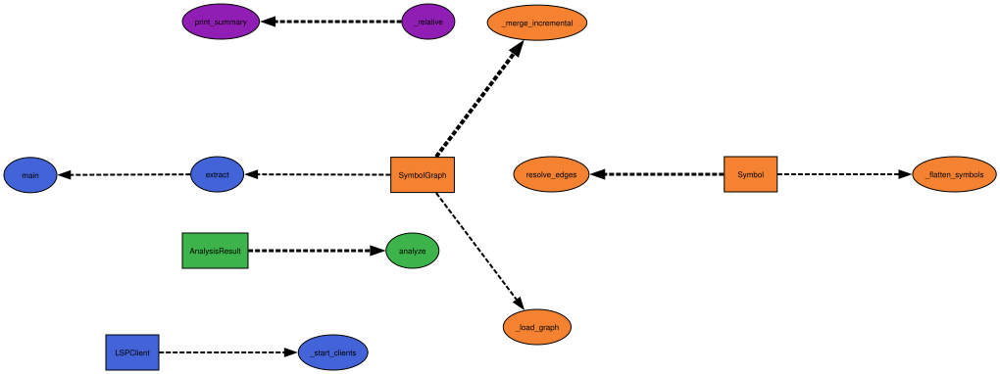

Two external deps (igraph, leidenalg), zero parsing code.

This is CodeGraph, implemented with LSP servers. The idea is to utilize LSP output (which you probably already configured for auto-complete, syntax highlighting etc) and provide network analysis on your code. This should be a fine addition to your Claude skills. Currently only supports `gopls` and `pyright-langserver`. Install them

```bash
# Python — pyright via uv
uv tool install pyright

# Go — gopls
go install golang.org/x/tools/gopls@latest
```

# Architecture:
- `lsp.py`: JSON-RPC client over stdio. Threads a reader, dispatches responses by ID, ignores server-initiated notifications (diagnostics, logs). Works with any LSP server. ~170 lines replacing whatever tree-sitter glue you had.
- `extract.py`: Drives textDocument/documentSymbol per file, then textDocument/references and callHierarchy/outgoingCalls per interesting symbol (classes, functions, methods, structs). Flattens hierarchical DocumentSymbol responses into qualified names. Skips vendored dirs, `__pycache__`, .pb.go.
- `graph.py`: Collapses symbol-level edges to file-level coupling (undirected, weighted by reference count). Runs Leiden with configurable resolution. Reports communities, modularity score, top coupling pairs.
- `__main__.py` :Two modes: full extraction and --diff (incremental). Incremental loads a previous graph, re-extracts only the listed files, merges, re-runs Leiden.
## Usage on your workstation:
```bash
uv run codegraph /path/to/repo
uv run codegraph /path/to/repo -o report.json --save-graph graph.json
uv run codegraph /path/to/repo --diff src/changed.py --load-graph graph.json
uv run codegraph /path/to/repo --resolution 2.0  # more granular communities
```

## Visualisation
Needs graphviz

```bash
python3 scripts/visualise.py report.json | sfdp -Tsvg -o codegraph.svg
```



Nodes colored by _Leiden community_, edge thickness scaled by coupling weight. `sfdp` over `dot` because force-directed handles coupling graphs without a natural hierarchy better: `dot` tries to find a DAG ranking that doesn't exist here.
If the graph is small enough that you want labeled edges: append `label={e['weight']}` inside the edge attributes. If it's huge and the SVG is unreadable, swap `sfdp` for `neato -Gstart=random` and crank iterations, or add `-Goverlap=false -Gsep=+10` to spread nodes.

## Known tradeoffs you'll hit:
- The initial extraction is O(interesting_symbols) LSP round-trips. For a large repo that could be minutes on first run. Subsequent `--diff` runs are fast :only changed files get re-queried.
- gopls call hierarchy is solid. pyright call hierarchy support is spottier :it implements prepareCallHierarchy but outgoingCalls may return incomplete results for dynamic dispatch. The code degrades gracefully: if call hierarchy isn't available, it falls back to reference-only edges. You get a coupling graph either way, just with less semantic precision on the call direction.
- The _dispatch handler silently swallows server requests (like window/showMessageRequest) by returning `null`. Some servers may not like that. If you see hangs, that's the first place to look.